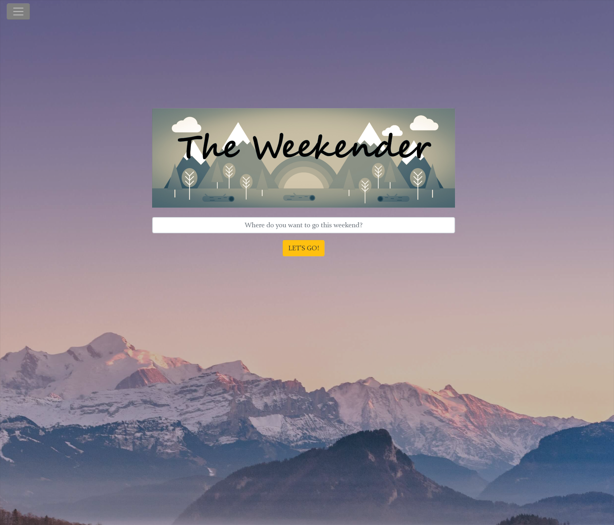
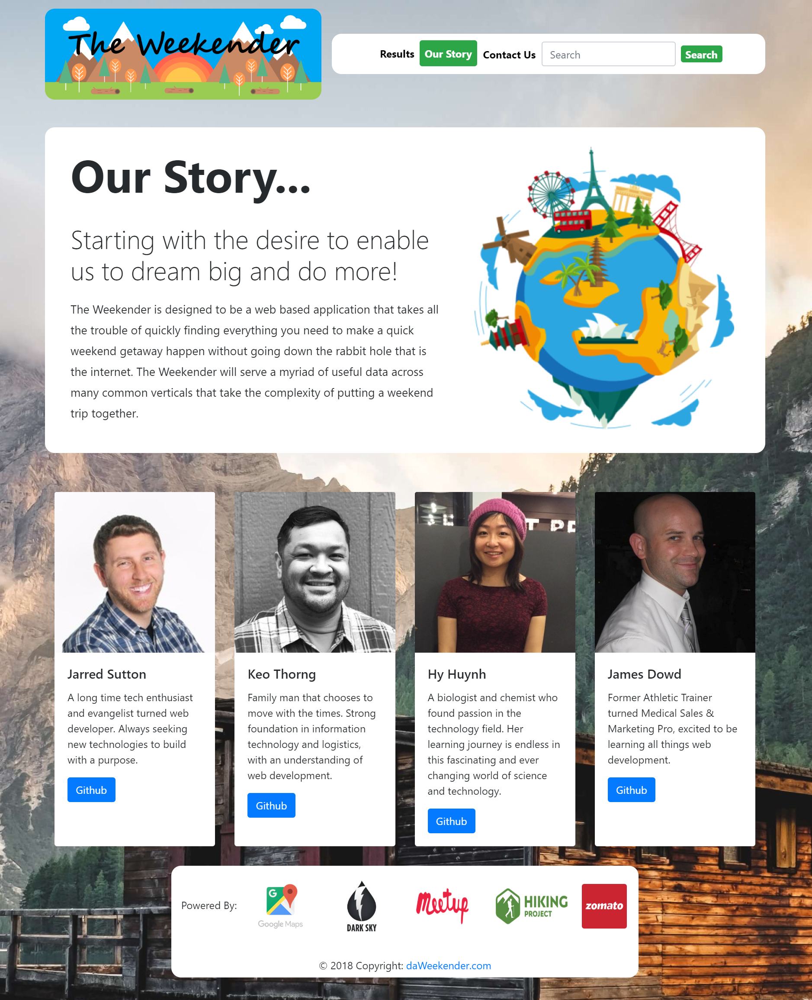

# The Weekender :airplane::car::bus::ship::rocket::bike::steam_locomotive:

Planning a weekend getaway?  The Weekender was conceived as a way to pull all the information you need for your weekend trip into one web application.  

Enter your desired location, and The Weekender will return weather foreacast information for the coming weekend, a map including driving directions, upcoming events, local restaurants, and even popular hiking trails in the area.  If you're having trouble deciding where to go, you can even view the most recent searches of previous users.  

# APIs used in the creation of this site:

Weather -- https://darksky.net/dev

Map/Directions -- https://developers.google.com/maps/documentation/

Events -- https://www.meetup.com/meetup_api/

Restaurants -- https://developers.zomato.com/api

Hiking -- https://www.hikingproject.com/data

Recent user search information is stored in Firebase -- https://firebase.google.com/

For more information on the site creators, click on the "Our Story" tab to read a short bio of each team member.  

## The Weekender - Landing Page
Here you are greeted with a simple ask to get your weekend research started. Simply kick off your experience with a single location search. The background seamlessly rotates for your travel making inspirational pleasure!

## The Weekender - Results Page
Once you launch your search you are transported to the results page where you are provided with a myriad of useful information. Here you can quickly

- See the coming weekend weather..that won't get in your way!
- Check out the chosen location on a map with one click directions planning!
- Quickly thumb through some of the best local restaurants and cuisines!
- Instantly inquire about the most hoppin' local events from locals themselves!
- Curious about getting a little nature in? Don't worry we got you covered with the most popular local trails!
- Last, but not least keep a running reminder list of your past five searches that is persistant through a refresh; all supported via firebase!

The best part about all these inqueries you can make? You can tab through them at your leasure at up to 100 results easily in one single page. Don't stop at just one search. Where is the fun in that??

## The Weekender - Our Story Page
We wanted to take the time and give you a small blurb about what we are all about and also a brief statement and photo of the creators of The Weekender! We believe strongly in the power of leveraging technology to make more happen in our lives, especially on the fun side. So visit Our Story page and click on our Github links to check out more of our own personal work. Thanks for stopping by!
